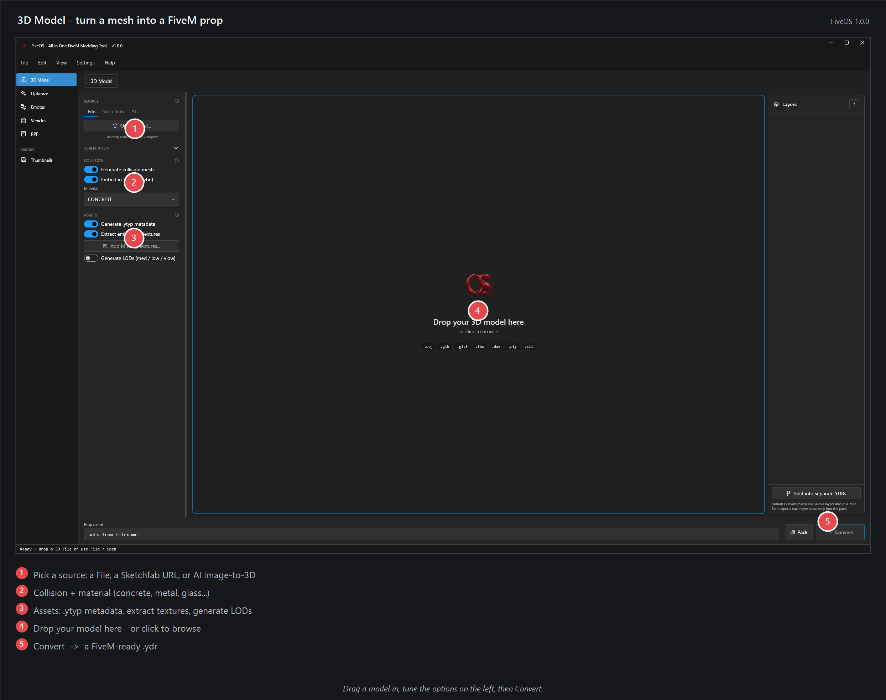

# 3D Model — turn a 3D file into a FiveM prop

Have a 3D model (`.glb`, `.fbx`, `.obj`, and more)? Drop it here and FiveOS turns it into a prop you can place in your server.

## How to use it
1. Drag your model onto the preview area.
2. Move, rotate, or scale it with the handles. Press **W** to move, **E** to rotate, **R** to scale.
3. Check the size numbers. If they turn red, your model is too heavy — see the Optimize tab to shrink it.
4. Type a name at the bottom (or leave it to fill in from the file name).
5. Click **Convert**.

Your finished files go to your Documents folder, under **FiveOS\Output**. Drop them into your server's `resources`.

## Tips
- A person-shaped figure stands next to your model so you can check it's the right size.
- Use the **Match** button to snap your prop to a normal height.
- Toggle **Wireframe** at the bottom-right to see the shape without colors.

## If it doesn't work
- **Model is tiny or huge:** it was saved in the wrong units — re-export it from your 3D program in metres.
- **No texture showing:** use **Add Missing Textures...** in the Assets panel (or the layer’s Change textures menu) and pick the picture files — they show in the preview and bake into the export on Convert. Textures next to the model (or in a `textures/` folder beside it) are also picked up automatically.
- **Convert button greyed out:** you haven't loaded a model yet — drag one in first.
