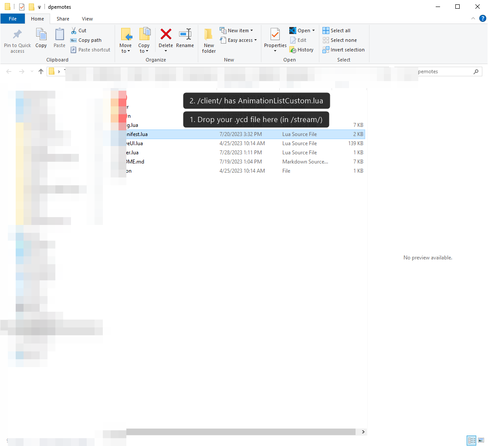

# Install your emote in dpemotes

You exported a `.dpemotes.zip` from FiveOS. Here's how to make it playable on your server. Takes a couple of minutes.



## Steps

1. Find your **dpemotes** folder on the server. It's usually at `resources/[addons]/dpemotes/`.

2. Unzip the FiveOS `.zip` on top of that folder. The animation file drops into the right spot automatically.

3. Open the small `.lua` text file from the zip, copy everything inside it, and paste it into `dpemotes/client/AnimationListCustom.lua`. Save.

4. Restart the resource. In your server console or txAdmin, type:

   ```
   restart dpemotes
   ```

   (A full server restart works too.)

5. Jump in-game and type `/e mywave` (use the name you saved it as).

## If it doesn't work
- **Nothing happens when you play it:** make sure the animation file landed in `dpemotes/stream/` and its name matches the name in your snippet.
- **Prop is missing:** the prop name might be wrong or not loaded on your server. Try `prop_phone_ing` first — it always exists.
- **Prop is in the wrong spot:** nudge the placement numbers in the snippet a little at a time.
