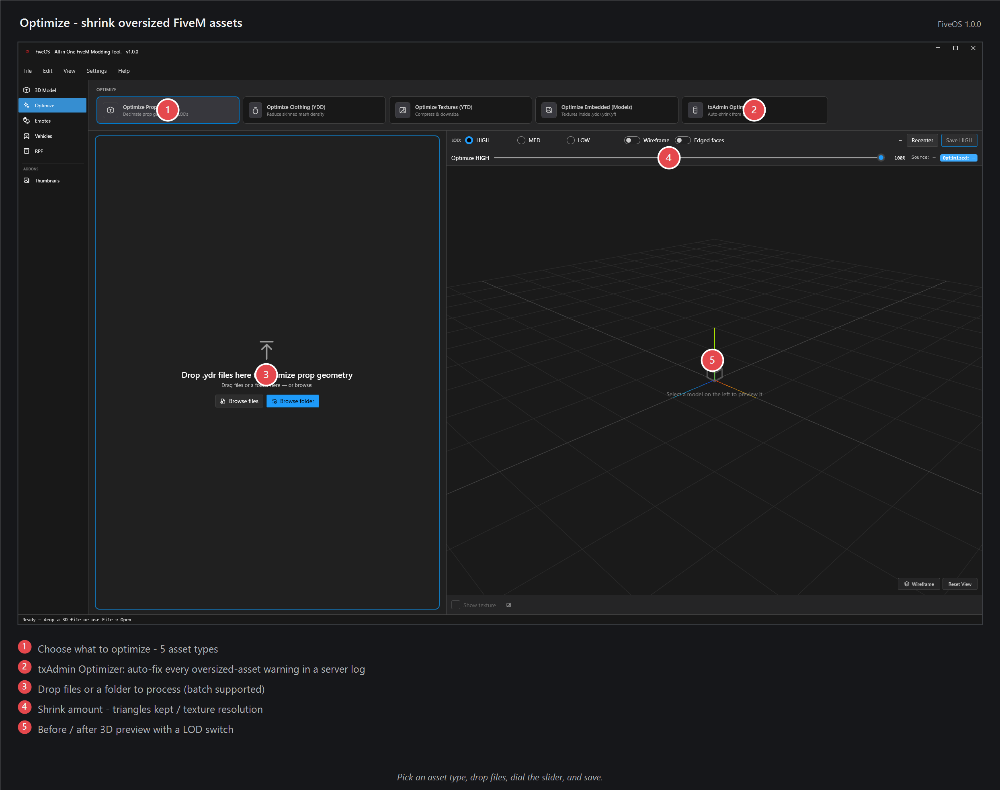

# Optimize — shrink heavy files so they don't lag your server

Big models and textures can slow a FiveM server down. Drop them here and FiveOS makes them smaller while keeping them looking good. Your original files are never changed — you get a new, smaller copy next to them.

## How to use it
1. Pick what you're shrinking: **props**, **clothing**, **textures**, or **vehicles**.
2. Drag your files onto the middle of the window.
3. Set how much to keep with the slider — start in the middle. More = better looking, less = smaller.
4. Click **OPTIMIZE**.
5. Find the new smaller copy next to your originals and drop it into your server.

Not sure which files are too big? The built-in **txAdmin Optimizer** reads your server's log, finds the oversized files for you, and shrinks just the ones that need it.

## Tips
- Converting a whole singleplayer car? Use the **Vehicles** tab instead — it does this for you with a 3D preview.
- If a file barely got smaller, it may be the textures — shrink those separately under **textures**.

## If it doesn't work
- **Model looks blocky afterwards:** you shrank it too much — move the slider up and try again.
- **Holes in clothing:** turn on **Preserve open boundaries**.
