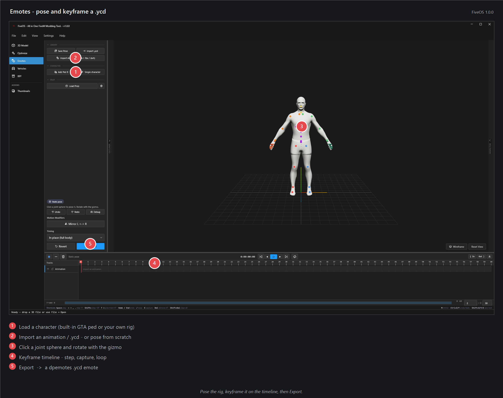
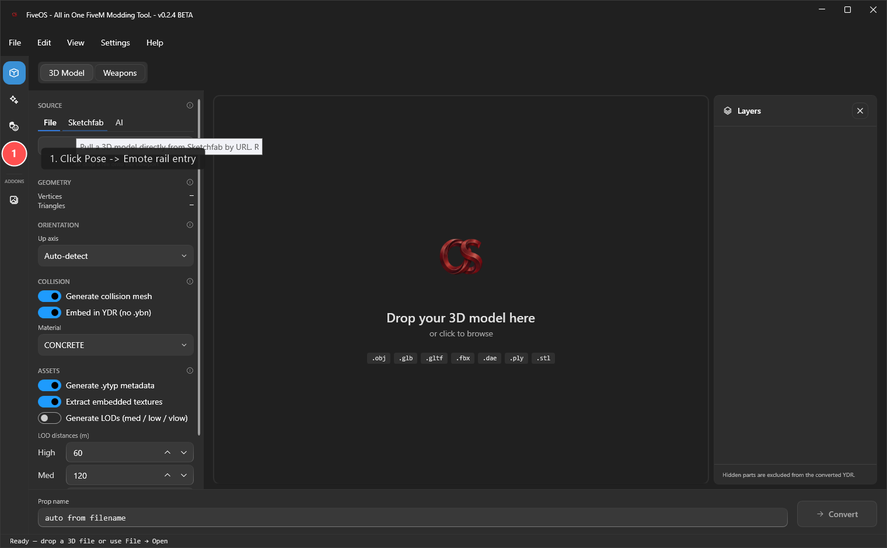
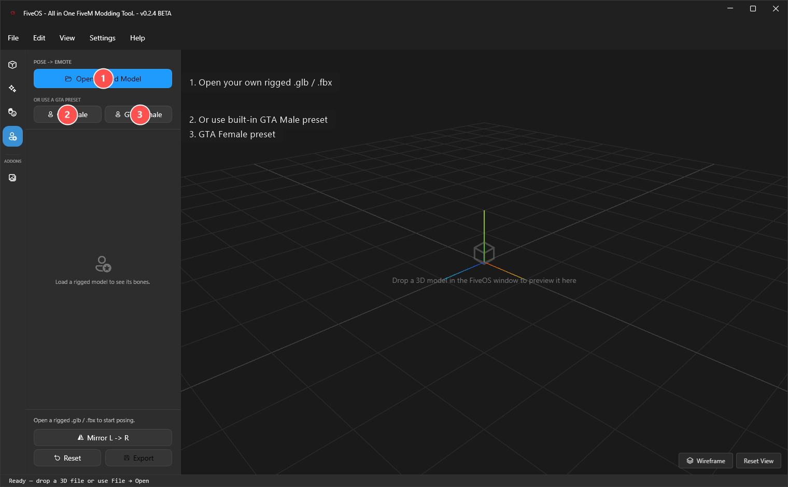
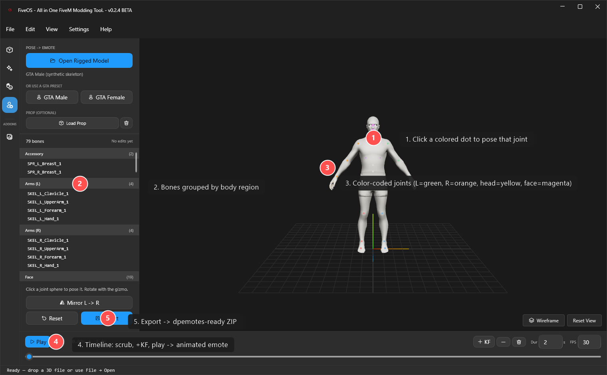

# Pose → Emote — make a FiveM emote from scratch

Pose a character, hit Export, and you get a ready-to-use FiveM emote. No 3D experience needed — about 5 minutes.

You'll need FiveOS and a FiveM server with **dpemotes** (most servers already have it). You don't need GTA V installed — FiveOS comes with its own character to pose.

## Steps

1. Open FiveOS and click **Emotes** on the left. Stay on **Pose → Emote**.

   

2. Click **GTA Male** to load the built-in character (the easy path).

   

3. A figure appears with colored dots on every joint. Click a dot to grab that joint.

   

4. Drag the colored rings that pop up to rotate the joint. Repeat until the pose looks right. **Mirror L→R** copies a left-arm pose to the right. **Reset** undoes everything.

5. Click **Export**, pick a short lowercase name like `mywave`, and save. That name is what players type in-game: `/e mywave`.

6. Install it — see **[EXPORT_TO_FIVEM.md](EXPORT_TO_FIVEM.md)**.

## Want it to move?

The timeline has two editing modes:

- **Sequencer** edits whole animation clips. Click to select, drag to move, drag either edge to trim, or use Split at the playhead. Shift/Ctrl select multiple clips; drag empty space for marquee selection.
- **Dope Sheet** edits keys on individual bones. Search the track hierarchy, select or box-select keys, drag to retime, set easing with the right-click menu, and mute or lock tracks.

Pose the character and click the key button to capture a key at the playhead. Use **Space** to play, **Delete** to remove the selection, **Ctrl+C/V/D** to copy, paste, or duplicate, and **Ctrl+Z/Y** to undo or redo. Mouse-wheel pans; Ctrl+wheel zooms; **Snap** keeps edits on frame boundaries (hold Shift to bypass it).

Animation imports remain visible while processing: the editor stays usable and reports progress in a small non-blocking HUD.

## Import an animation

Already have motion — from Mixamo, ActorCore, Cascadeur, the CMU BVH library, or a Sims 4 pose pack? Click **Import Animation** and pick the file (`.glb` / `.gltf` / `.fbx` / `.dae` / `.bvh` / `.package`). FiveOS retargets it onto the GTA skeleton and drops it on the timeline as keyframes; tweak it there and Export like any other emote. **Import .ycd** does the same for an existing GTA animation you want to edit.

### Best results: export in the retarget's sweet spot

The retarget is tuned for one clean input: a **humanoid rig in a T-pose bind** (arms out horizontal), Y-up, with the animation baked. FiveOS now runs an **input health check** on every import and tells you — right in the status bar — whether your file is in that sweet spot (`✓ T-pose bind detected`) or needs a better export (`⚠ A-pose … re-export in T-pose`). Aim for the `✓`. Per source:

| Source | Export it like this |
| --- | --- |
| **Namespaced mocap FBX** | Export the **pre-retarget FBX** (Mixamo-compatible bone names) and include the **frame `-1` T-pose** as the bind. |
| **Mixamo** | Download **FBX**, "With Skin", default **T-pose** — do not pick an A-pose character. |
| **Rokoko** | Retarget to a **Mixamo/HumanIK** target and export FBX in T-pose. |
| **ActorCore / Character Creator** | Export FBX with the **CC_Base** rig in T-pose (not the A-pose "Calibration" pose). |
| **Cascadeur** | Bake the animation, ensure the rest/bind frame is a **T-pose**, export FBX. |
| **Blender** | Pose the armature to a **T** before export; glTF or FBX both work. |

An A-pose or "relaxed" bind still imports, but the arms and shoulders will sit less faithfully — the health check will flag it so you know before you dig into the viewport.

If a pose reads slightly wrong on the ped — arms clipping the body, a stance that's too closed — open the **Inspector** rail (right edge) and adjust **Body Calibration** while the preview updates live.

## Tips
- The dots are color-coded by body part (green = left arm, orange = right arm, and so on).
- Hotkeys: **R** rotate, **W** move, **E** scale.
- Saved poses live in the sidebar — pose the ped, hit **Save Pose**, and re-apply it any time with one click.
