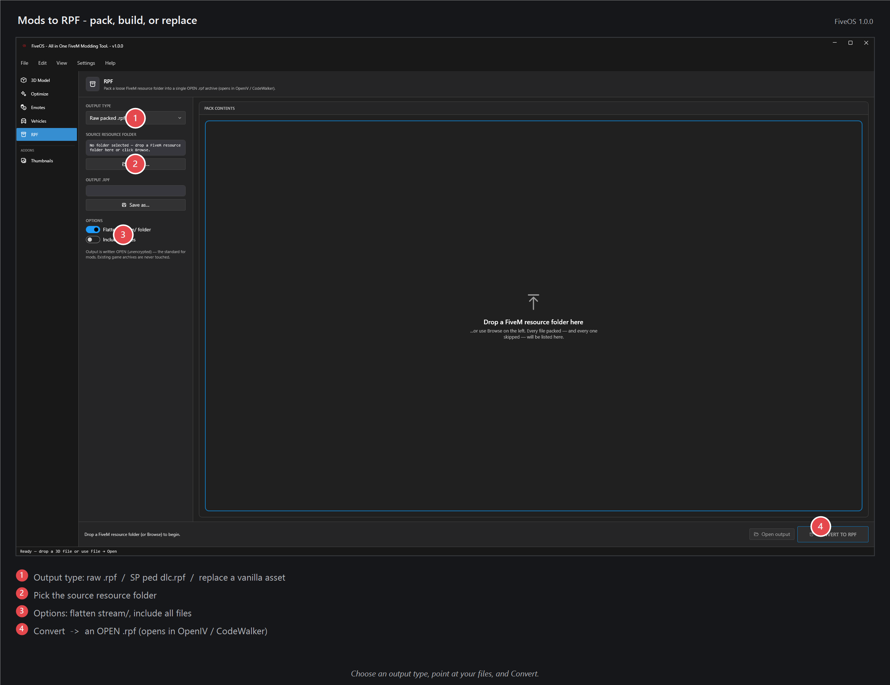

# Mods → RPF — pack, build, add, or replace a mod

Bundle your finished work into a single mod file that GTA tools and servers can use. Pick one of four jobs and FiveOS does the packing for you.

## How to use it
1. Pick what you want to make:
   - **Raw packed `.rpf`** — squeeze a resource folder into one shareable file.
   - **Singleplayer ped `dlc.rpf`** — turn a character model into a singleplayer add-on.
   - **Add-on asset** — stream your model as a brand-new item with its own name (nothing stock is touched).
   - **Replace an existing asset** — swap a stock GTA item (like a phone prop) for your own.
2. Drag in your files (for a replacement, type the exact name of the item you're swapping; for an add-on you can optionally give the model a new name).
3. Click build, then grab the finished file from the output folder.

## Tips
- **Add-on** builds a FiveM server resource with a `.ytyp`, so the new item is spawnable by name (CreateObject, `.ymap` placement, housing/furniture scripts).
- **Replace** has two options: *server-side* (everyone sees it) or *client-side* (only you).
- Client-side swaps only show for you, and many servers block them — use server-side to share.

## If it doesn't work
- **Replacement not showing?** The item name must match the stock file's name exactly.
- **Ped clothing missing?** Freemode/EUP outfits get flagged — they aren't a simple add-on.
- **Client-side swap invisible on a server?** That server blocks them; use the server-side option.
