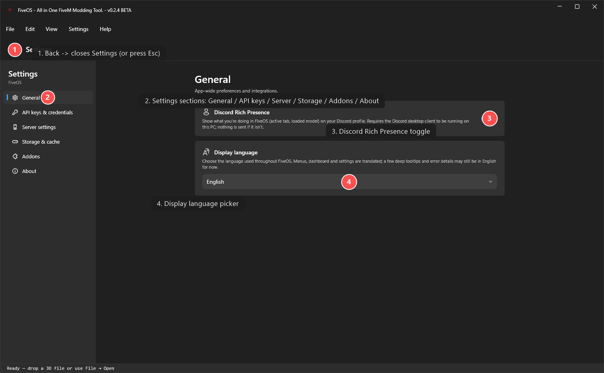

# Settings — all your options in one place

Open Settings from the title-bar menu (or the gear icon). Close it with **Back** at the top-left, or press **Esc**.

Pick a section on the left. Here's what each one does.

## Sections

- **General** — app-wide preferences. Turn on **Discord Rich Presence** to show what you're doing in FiveOS on your Discord profile, and set the **display language** for the menus.
- **API keys & credentials** — paste keys for extras like downloading Sketchfab models or AI-generated 3D. Keys are stored safely on your PC and never shared.
- **Server settings** — point FiveOS at your FiveM server for optional features. Most people can skip this.
- **Storage & cache** — choose where FiveOS saves your finished files, and use **Clear cache** to free up space (this won't touch your saved work).
- **Addons** — switch optional tools on or off.
- **About** — see your version and check for updates.

## Tips
- If Discord presence does nothing, make sure the Discord desktop app is running.
- Your finished files land in `Documents\FiveOS\Output` by default.
