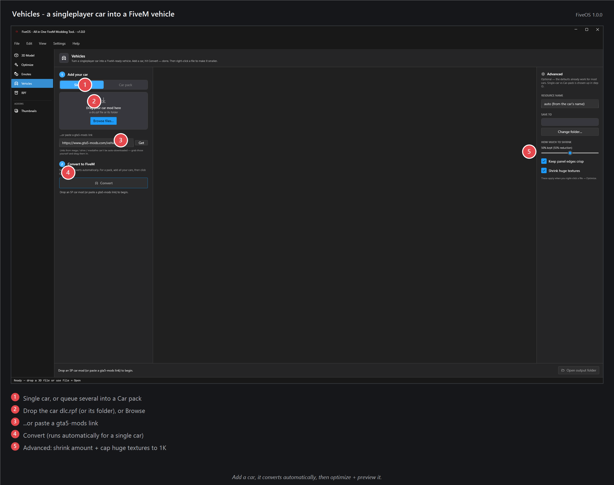

# Vehicles — turn a singleplayer car into a FiveM car

Got an add-on car for singleplayer GTA? Drop it here and FiveOS turns it into a FiveM resource for your server — and shrinks the huge files so they don't lag it.

## How to use it
1. Pick **Single car**, or **Car pack** to put several cars in one resource.
2. Drag the car's `dlc.rpf` file in — or paste a gta5-mods link.
3. It converts on its own. Click a car to see its files and a 3D preview.
4. Right-click a file → **Optimize** to shrink it (or **Optimize everything**).
5. Click **Open output folder**, drop it into your server's `resources`, then add `ensure your_car` to your `server.cfg`.

## Tips
- Car too heavy? Leave **Shrink huge textures** on (it already is).
- Building a pack? Add all the cars first, then click each one to check it.
- In the preview you can repaint the body, open the doors, and toggle extras.

## If it doesn't work
- **Files list is empty?** Click a car in the queue on the left to select it.
- **Car won't spawn in game?** Make sure your spawn command uses the car's model name.
- **Preview looks grey?** Click **GTA folder** and point it at your GTA V install once.
